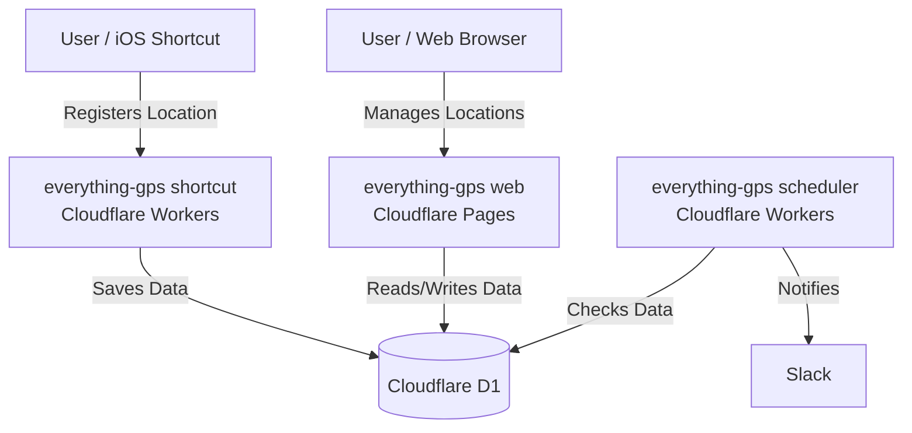

# everything-gps

An application to save locations of interest with GPS coordinates using iOS Shortcuts.

## Architecture

The system consists of the following three components:

### everything-gps (shortcut)

- Provides a landing page for registering iOS Shortcuts and an API for saving location data.
- Runs on **Cloudflare Workers**.
- Uses **Cloudflare D1** as the database.
- The API is invoked via iOS Shortcuts.

### everything-gps (web)

- A web application to view and manage saved location information.
- Runs on **Cloudflare Pages**.
- Retrieves location data from **Cloudflare D1**.

### everything-gps (scheduler)

- Notifies a Slack channel when location data exists in D1, reminding the user to review it.
- Runs on **Cloudflare Workers** using Cron Triggers.
- Retrieves location data from **Cloudflare D1**.
